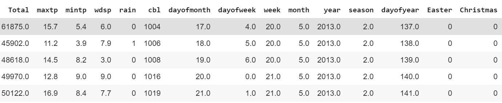
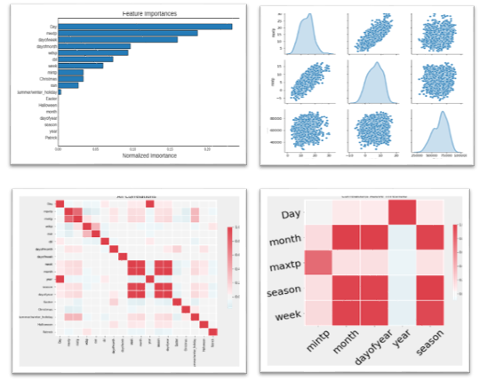
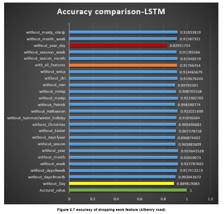
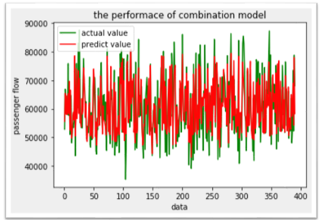
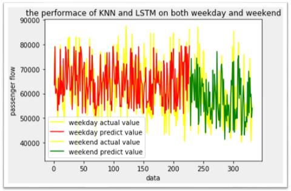

# Daily passenger flow prediction in Galway
## 1.Dataset processing
#### Code is in "data process" file
This part is processing passenger flow datasets and weather datasets. First, processing to tables (passenger flow and weather). Secondly, extracting useful columns and merging two tables together. Finaly, the table is as below.

## 2.Training five models
#### Code is in "five models" file
Training five models and testing the accuracy. Chosingg the models that are suitable for predicting passenger flow in Galway.

## 3.Feature visualization
### 1. Feature correlation analysis
#### Code is in "feature correlation analysis.py"
This part focus on analyzing features and visualizing the relationship between features. It including feature importance, feature correlation, etc.

### 1. Dropping features
#### Code is in "dropping features.py"
This part is dropping features based on previous analysis. Then predicting the passenger flow in Galway. Finally, Caluculate the accuracy and visualizing the predicted accuracy. 

## 3.Improve accuracy
#### Code is in "Improve accuracy" file
### 1. Ensemble learning
#### Code is in "ensemble_learning.py" 
This part is combining two models (KNN and LSTM) together, calculating accuracy and plot the predicted value and actual value.

### 2. Splitting datasets
#### Code is in "splitting_dataset_into_weekday_and_weekend.py" 
This part is splitting datasets into weekday and weekend, using KNN model to predicting the passenger flow on weekday and LSTM model to predict passenger flow on weekend.

